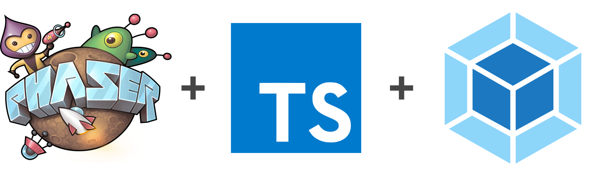

<h1 align="center">
  <br>
  <a href="https://github.com/yandeu/phaser-project-template#readme"></a>
  <br>
  Word War!
  <br>
</h1>

<h4 align="center">
A multi-player Word Game written in <a href="https://phaser.io/" target="_blank" >Phaser 3</a> with <a href="https://www.typescriptlang.org/index.html" target="_blank" >TypeScript</a> and <a href="https://webpack.js.org/" target="_blank" >webpack</a> for the browser and on mobile devices.</h4>

<p align="center">
  
  
</p>

---

## How To Use

To clone and run the game, you'll need [Git](https://git-scm.com) and [Node.js](https://nodejs.org/en/download/) (which comes with [npm](http://npmjs.com)) installed on your computer. From your command line:

```bash
# Clone this repository
$ git clone https://github.com/bmodi/wordwar.git

# Go into the repository
$ cd wordwar

# Install dependencies
$ npm install

# Start the local development server (on port 8080)
$ npm start

# Ready for production?
# Build the production ready code to the /dist folder
$ npm run build

# Play your production ready game in the browser
$ npm run serve
```


### Webpack

All webpack configs are in the **webpack** folder.

### Obfuscation

_Obfuscation is disabled by default._

We are using the [webpack-obfuscator](https://github.com/javascript-obfuscator/webpack-obfuscator). Change its settings in webpack/webpack.prod.js if needed. All available options are listed [here](https://github.com/javascript-obfuscator/javascript-obfuscator#javascript-obfuscator-options).

## Starter Template

This game was started with the excellent [phaser-project-template-es6](https://github.com/yandeu/phaser-project-template-es6#readme) template.


## Useful Links

- [Phaser Website](https://phaser.io/)
- [Phaser 3 Forum](https://phaser.discourse.group/)
- [Phaser 3 API Docs](https://photonstorm.github.io/phaser3-docs/)
- [Official Phaser 3 Examples](http://labs.phaser.io/)
- [Notes of Phaser 3](https://rexrainbow.github.io/phaser3-rex-notes/docs/site/index.html)


